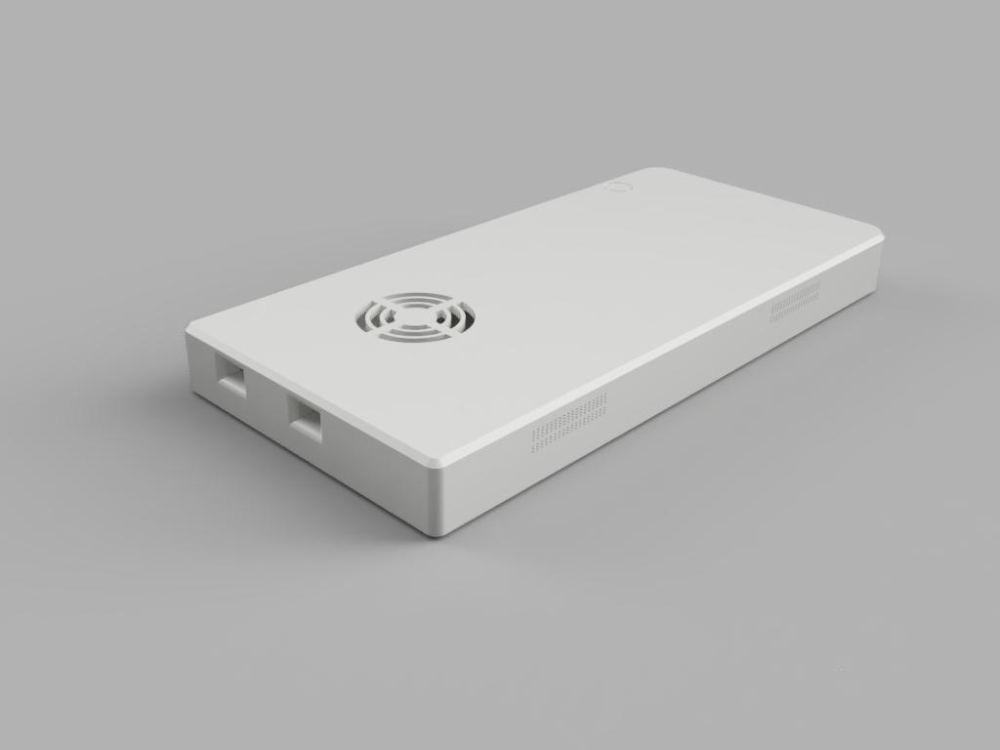
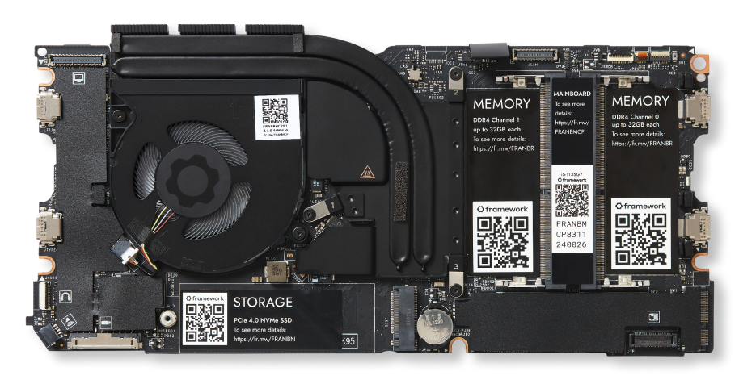

# NOVA Compute Unit (CU)

A NOVA system is managed via a central Compute Unit (CU). This is essentially a compact, portable personal computer -- a laptop without a screen. All sensors adn peripheral devices connect to the CU either using USB-C cables or wirelessly via bluetooth.

## Design Goals

The primary design goals for the CU were as follows:

  - Integrate adequate CPU and GPU processing power
  - Leverage off-the-shelf components where possible
  - Utilize modern standards for connectivity including
    + USB-C 3.2 (at least 2 available ports)
    + Wi-Fi 6
    + Bluetooth 5 + BLE
  - Integrated speakers for notifications & alerts when no headset is attached
  - Low heat and low power consumption
  - Multi-hour battery life with active use
  - Easy to charge with the potential for supplemental, external batteries
  - Optimized cost and value

...description of decision process...

## Components

The Compute Unit is comprised of the following components:

  - 3D-printed components including:
    + Case for mainboard, battery, speakers and wireless
    + Dock for integration into the Nova Shoulder Pack
    + Desktop dock for charging and maintenance
  - Framework Computer Inc. Mainboard -- the following have been validated:
    + [11th Gen Intel Core i5 1135G7](https://frame.work/products/mainboard?v=FRANFG000A)
    + [12th Gen Intel Core i5 1240P](https://frame.work/products/mainboard-12th-gen-intel-core?v=FRANGACP04)
  - [Framework Computer Inc. Battery](https://frame.work/products/battery)
  - [Framework Computer Inc. Speaker Kit](https://frame.work/products/speaker-kit?v=FRANBXFG03)
  - [Framework Computer Inc. Antenna Module](https://frame.work/products/antenna-module?v=FRANBA0001)
  - [Intel AX-210 Wi-Fi 6E Module](https://frame.work/products/intel-wi-fi-6e-ax210-no-vpro)

## Design & Specifications

### 3D-Printed Case

Description...download...etc.

### Framework Mainboard

Description...specifications...etc.

## Assembly Instructions

